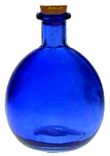
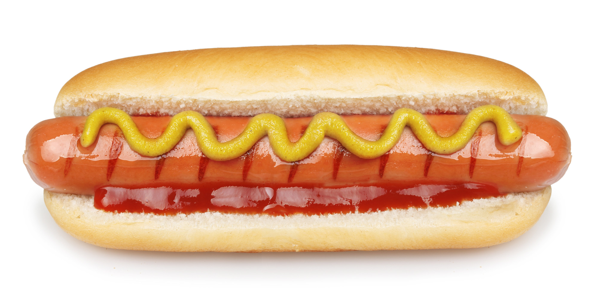

# hotdog-or-not-hotdog
Implementation of Hot Dog or not app from Silicon Valley (CNN to identify if the given picture is a hot dog or not)

I used Google's Inception (2015) model. Inception is a deep convolutional neural network built for classifying real world images of thousand category. <br/>
Retraining done by replacing last layer of Inception model. <br/>
Training has been done using around 300 images so the accuracy for certain images might be low. <br/>

## Getting started
1. Clone and run bash on this repository. (Ensure that you have TensorFlow installed.)
2. Then run `python label_dog.py test/bottle.jpg`

3. Wait for the model's prediction.
4. Here's the result you should expect if things work correctly:
```
not hot dog          : 0.93821
hot dog              : 0.06179
```
5. For hot dog run `python label_dog.py test/hotdog.jpg`

6. The result comes out as 
```
hot dog              : 0.99862
not hot dog          : 0.00138
```
